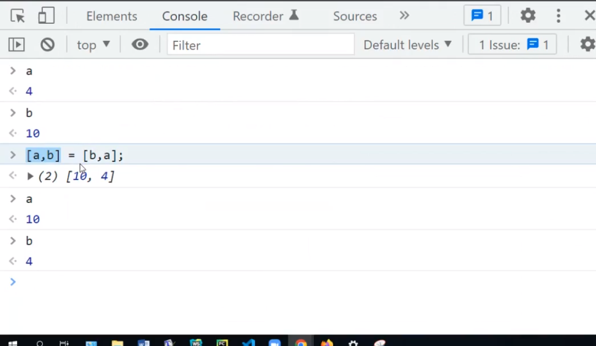
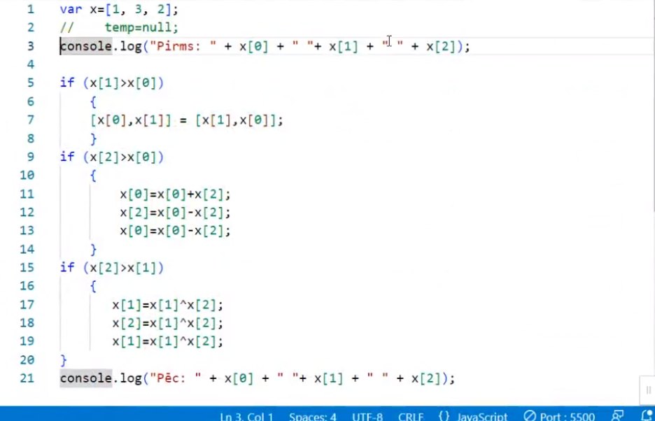

<h2> How to Swap two variables in JavaScript </h2>

1. Resource - https://stackoverflow.com/questions/16201656/how-to-swap-two-variables-in-javascript
    

2. Resource - https://dmitripavlutin.com/swap-variables-javascript/

3. JS variable swapping and array, teacher example:
    

